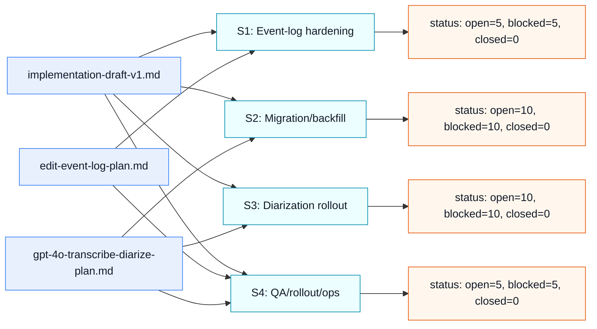

# Deep Task Breakdown v1 (Specs -> Executable Tasks)

## Scope
- Repository: `/home/strato-space/voicebot`
- Source specs:
  - `plan/implementation-draft-v1.md`
  - `plan/edit-event-log-plan.md`
  - `plan/gpt-4o-transcribe-diarize-plan.md`

## Goal
Convert high-level spec phases into granular executable tasks with clear dependencies, outputs, acceptance criteria, and effort.

## Delivery Streams
- **S1**: Event-log hardening and operational readiness.
- **S2**: Historical migration/backfill (`segment_oid` + `object_locator`).
- **S3**: Diarization rollout (`gpt-4o-transcribe-diarize`) with immutable contract.
- **S4**: QA, rollout, and observability.

## WBS (Granular Tasks)

### S1. Event-Log Hardening (post-v1 stabilization)

#### S1-T01. Contract snapshot freeze
- Description: freeze current API/event payload contracts as baseline.
- Input: current controllers + specs.
- Output: contract checklist doc section in this file.
- Acceptance:
  - all routes and event fields mapped 1:1;
  - known legacy aliases explicitly listed.
- Estimate: 1h
- Dependencies: none

#### S1-T02. Event taxonomy audit
- Description: validate all emitted event names are lowercase snake_case and grouped correctly.
- Output: list of actual emitted events with source files.
- Acceptance:
  - no uppercase/mixed-case event names;
  - every event mapped to domain taxonomy.
- Estimate: 1.5h
- Dependencies: S1-T01

#### S1-T03. Idempotency policy for replayable actions
- Description: define and enforce idempotency keys for rollback/resend/retry actions.
- Output: handler-level idempotency strategy + tests.
- Acceptance:
  - repeated same action cannot corrupt state;
  - dedup behavior documented.
- Estimate: 3h
- Dependencies: S1-T01

#### S1-T04. Session-log indexes review
- Description: verify and (if needed) add indexes for session log reads.
- Output: index migration script.
- Acceptance:
  - index coverage for `session_id,event_time`, `message_id`, `event_name`;
  - explain plan confirms IXSCAN on main queries.
- Estimate: 2h
- Dependencies: S1-T01

#### S1-T05. API schema examples refresh
- Description: align request/response examples with optional `reason` and current path format.
- Output: updated docs blocks.
- Acceptance:
  - all examples match live handlers;
  - no stale `required reason` artifacts left.
- Estimate: 1h
- Dependencies: S1-T01

### S2. Migration / Backfill (voicebot-0ly.4)

#### S2-T01. Migration preflight + dry-run script
- Description: implement script to scan impact and estimate runtime before write phase.
- Output: CLI script + report JSON.
- Acceptance:
  - reports total candidate messages/sessions;
  - reports missing `transcription.segments[].id` and locator gaps.
- Estimate: 3h
- Dependencies: none

#### S2-T02. Read-only maintenance toggle
- Description: implement safe switch procedure for maintenance window.
- Output: runbook section + command sequence.
- Acceptance:
  - writes to editing endpoints blocked during migration window;
  - rollback command documented.
- Estimate: 1.5h
- Dependencies: S2-T01

#### S2-T03. Canonical transcription backfill
- Description: for legacy messages, build `transcription` from legacy sources when absent/incomplete.
- Output: idempotent update routine.
- Acceptance:
  - every migrated message has canonical `transcription` object;
  - rerun does not duplicate/change stable facts unexpectedly.
- Estimate: 4h
- Dependencies: S2-T01

#### S2-T04. Segment ID backfill (`ch_<hex24>`)
- Description: assign stable segment ids for messages lacking `segments[].id`.
- Output: deterministic backfill routine.
- Acceptance:
  - each segment has valid `ch_` id;
  - no index-based addressing remains.
- Estimate: 3h
- Dependencies: S2-T03

#### S2-T05. Object locator backfill
- Description: populate `automation_object_locator` for embedded segments.
- Output: upsert-based backfill routine.
- Acceptance:
  - unique `oid` entries for all migrated segments;
  - parent refs (`parent_id`, `path`) valid.
- Estimate: 3h
- Dependencies: S2-T04

#### S2-T06. Integrity verifier
- Description: verification pass for segment<->locator consistency and broken refs.
- Output: verifier CLI + summary.
- Acceptance:
  - zero dangling locator refs;
  - mismatch report generated if any anomalies.
- Estimate: 2h
- Dependencies: S2-T05

#### S2-T07. Batch strategy + retries
- Description: execute migration in controlled batches with resumable checkpoints.
- Output: batch executor params (`batch_size`, checkpoint cursor).
- Acceptance:
  - process can resume after interruption;
  - no full rerun required on failure.
- Estimate: 2h
- Dependencies: S2-T03

#### S2-T08. Dev migration run + metrics
- Description: run full backfill in dev and collect timing/error metrics.
- Output: dev run report.
- Acceptance:
  - migration completes with zero fatal errors;
  - throughput baseline captured.
- Estimate: 2h
- Dependencies: S2-T06, S2-T07

#### S2-T09. Prod migration runbook finalization
- Description: finalize production execution checklist and rollback path.
- Output: explicit runbook steps (pre/during/post).
- Acceptance:
  - includes owner, start/stop criteria, rollback triggers;
  - includes validation queries.
- Estimate: 1.5h
- Dependencies: S2-T08

#### S2-T10. Prod migration execution
- Description: execute migration in maintenance window.
- Output: completed migration and report.
- Acceptance:
  - all target docs migrated;
  - post-check integrity pass successful.
- Estimate: 2h
- Dependencies: S2-T09

### S3. Diarization Rollout (voicebot-0ly.5)

#### S3-T01. Config flags and defaults
- Description: finalize env flags for diarization model/fallback behavior.
- Output: config wiring + `.env.example` update.
- Acceptance:
  - explicit toggles for diarized vs fallback mode;
  - default behavior documented.
- Estimate: 1h
- Dependencies: none

#### S3-T02. OpenAI diarized adapter
- Description: implement adapter for `gpt-4o-transcribe-diarize` (`diarized_json`).
- Output: provider call wrapper.
- Acceptance:
  - captures full provider payload to `transcription_raw`;
  - handles API errors explicitly.
- Estimate: 3h
- Dependencies: S3-T01

#### S3-T03. Model-agnostic normalizer
- Description: map provider payload to canonical immutable `transcription`.
- Output: normalizer module + tests.
- Acceptance:
  - stable canonical shape (`schema_version`, `segments`, `usage`, etc.);
  - compatible with fallback model output.
- Estimate: 4h
- Dependencies: S3-T02

#### S3-T04. Fallback orchestration
- Description: fallback to whisper path when diarized payload invalid/unavailable.
- Output: fallback branch with reason codes.
- Acceptance:
  - fallback occurs automatically for known failure modes;
  - fallback reason logged in metadata.
- Estimate: 2h
- Dependencies: S3-T02

#### S3-T05. Direct transcription path integration
- Description: integrate adapter+normalizer into direct/small-file path.
- Output: updated transcribe flow.
- Acceptance:
  - `transcription_raw -> transcription` persisted;
  - `transcription_text/text` mirrors canonical text.
- Estimate: 2h
- Dependencies: S3-T03, S3-T04

#### S3-T06. Segmented path integration
- Description: integrate diarization path into segmented processing flow.
- Output: updated segmented transcribe flow.
- Acceptance:
  - segment stitching preserves speaker and timing coherence;
  - stable `ch_` ids assigned.
- Estimate: 3h
- Dependencies: S3-T03, S3-T04

#### S3-T07. Categorization input alignment
- Description: ensure categorization consumes canonical segments with speakers.
- Output: categorization input adapter.
- Acceptance:
  - speaker-aware data passed when available;
  - no in-place mutation of transcription facts.
- Estimate: 2h
- Dependencies: S3-T03

#### S3-T08. UI speaker display policy implementation
- Description: enforce deterministic speaker display mapping (`Спикер N` fallback).
- Output: UI mapping helper + rendering updates.
- Acceptance:
  - raw speaker kept in data;
  - display mapping deterministic across refreshes.
- Estimate: 2h
- Dependencies: S3-T03

#### S3-T09. Diarization observability
- Description: add structured logs/metrics for segment count, speakers, fallback rate.
- Output: log fields + metric counters.
- Acceptance:
  - dashboards/queries can distinguish diarized vs fallback runs;
  - no secret leakage in logs.
- Estimate: 2h
- Dependencies: S3-T05, S3-T06

#### S3-T10. Cost/latency guardrails
- Description: add budget limits and alerts for diarization latency/cost spikes.
- Output: thresholds + runbook note.
- Acceptance:
  - threshold breach path documented;
  - fallback strategy linked to guardrails.
- Estimate: 1.5h
- Dependencies: S3-T09

### S4. QA / Rollout / Ops

#### S4-T01. Unit test expansion
- Description: add tests for normalizer, fallback routing, optional reason semantics.
- Output: test cases in `__tests__/controllers` and helper tests.
- Acceptance:
  - critical branches covered;
  - green in CI/local.
- Estimate: 3h
- Dependencies: S3-T03, S3-T04

#### S4-T02. Integration matrix
- Description: e2e coverage for edit/delete/rollback/resend/retry + diarization paths.
- Output: integration test set + sample fixtures.
- Acceptance:
  - all critical flows validated end-to-end;
  - regression matrix documented.
- Estimate: 3h
- Dependencies: S2-T08, S3-T06, S3-T07

#### S4-T03. Dev smoke checklist
- Description: create repeatable smoke checklist for voice-dev.
- Output: runbook steps + expected outputs.
- Acceptance:
  - one-command summary of health/test URLs;
  - includes session-level manual checks.
- Estimate: 1h
- Dependencies: S4-T02

#### S4-T04. Release checklist (dev -> prod)
- Description: explicit go/no-go gates with rollback criteria.
- Output: release checklist in plan docs.
- Acceptance:
  - gate conditions measurable;
  - rollback procedure time-bounded.
- Estimate: 1h
- Dependencies: S2-T10, S4-T02

#### S4-T05. Post-release validation
- Description: validate production behavior after deployment.
- Output: post-release report.
- Acceptance:
  - event-log API latency, error rates, and diarization fallback rate within thresholds;
  - no schema drift detected.
- Estimate: 1h
- Dependencies: S4-T04

## Critical Dependency Chain (Shortest Path to Value)
1. Contract and migration readiness:
   - `S1-T01` -> `S2-T01` -> `S2-T03` -> `S2-T04` -> `S2-T05` -> `S2-T06` -> `S2-T08` -> `S2-T09` -> `S2-T10`
2. Diarization enablement:
   - `S1-T01` -> `S3-T01` -> `S3-T02` -> `S3-T03` + `S3-T04` -> `S3-T06` -> `S3-T07` -> `S3-T09` -> `S3-T10`
3. Release quality gate:
   - `S4-T01` + `S4-T02` -> `S4-T03` -> `S4-T04` -> `S4-T05`

## BD Mapping (Actual IDs)
- Epic:
  - `voicebot-0ly`
- Stream S1 (hardening):
  - `S1-T01` -> `voicebot-0ly.14`
  - `S1-T02` -> `voicebot-0ly.15`
  - `S1-T03` -> `voicebot-0ly.16`
  - `S1-T04` -> `voicebot-0ly.17`
  - `S1-T05` -> `voicebot-0ly.18`
- Stream S2 (migration/backfill) parent `voicebot-0ly.4`:
  - `S2-T01` -> `voicebot-0ly.4.1`
  - `S2-T02` -> `voicebot-0ly.4.2`
  - `S2-T03` -> `voicebot-0ly.4.3`
  - `S2-T04` -> `voicebot-0ly.4.4`
  - `S2-T05` -> `voicebot-0ly.4.5`
  - `S2-T06` -> `voicebot-0ly.4.6`
  - `S2-T07` -> `voicebot-0ly.4.7`
  - `S2-T08` -> `voicebot-0ly.4.8`
  - `S2-T09` -> `voicebot-0ly.4.9`
  - `S2-T10` -> `voicebot-0ly.4.10`
- Stream S3 (diarization) parent `voicebot-0ly.5`:
  - `S3-T01` -> `voicebot-0ly.5.1`
  - `S3-T02` -> `voicebot-0ly.5.2`
  - `S3-T03` -> `voicebot-0ly.5.3`
  - `S3-T04` -> `voicebot-0ly.5.4`
  - `S3-T05` -> `voicebot-0ly.5.5`
  - `S3-T06` -> `voicebot-0ly.5.6`
  - `S3-T07` -> `voicebot-0ly.5.7`
  - `S3-T08` -> `voicebot-0ly.5.8`
  - `S3-T09` -> `voicebot-0ly.5.9`
  - `S3-T10` -> `voicebot-0ly.5.10`
- Stream S4 (QA/release) under epic:
  - `S4-T01` -> `voicebot-0ly.9`
  - `S4-T02` -> `voicebot-0ly.10`
  - `S4-T03` -> `voicebot-0ly.11`
  - `S4-T04` -> `voicebot-0ly.12`
  - `S4-T05` -> `voicebot-0ly.13`

## Status Snapshot (Beads)
- Source commands:
  - `bd status`
  - `bd list --all --json`

### Portfolio Status
| Metric | Value |
|---|---:|
| Total issues | 46 |
| Open | 33 |
| In progress | 1 |
| Blocked (dependency-blocked) | 30 |
| Closed | 11 |
| Ready to work | 3 |

### WBS Stream Status
| Stream | WBS IDs | Total | Open | In progress | Closed | Dependency-blocked* |
|---|---|---:|---:|---:|---:|---:|
| S1 | `voicebot-0ly.14`..`voicebot-0ly.18` | 5 | 5 | 0 | 0 | 5 |
| S2 | `voicebot-0ly.4.1`..`voicebot-0ly.4.10` | 10 | 10 | 0 | 0 | 10 |
| S3 | `voicebot-0ly.5.1`..`voicebot-0ly.5.10` | 10 | 10 | 0 | 0 | 10 |
| S4 | `voicebot-0ly.9`..`voicebot-0ly.13` | 5 | 5 | 0 | 0 | 5 |

`*` Dependency-blocked here means the issue has at least one unresolved dependency (`depends_on_id` not in `closed` state).

## Mermaid: Spec -> WBS -> Status

## Mermaid: Critical Delivery Chain (Task Subjects)

```mermaid
flowchart LR
  X14["Contract snapshot freeze"] --> X41["Migration preflight + dry-run script"]
  X41 --> X43["Canonical transcription backfill"]
  X43 --> X44["Segment ID backfill (ch_*)"]
  X44 --> X45["Object locator backfill"]
  X45 --> X46["Integrity verifier CLI"]
  X46 --> X48["Dev migration run and metrics"]
  X48 --> X49["Prod migration runbook finalization"]
  X49 --> X410["Production migration execution"]
  X410 --> X51["Config flags and defaults"]
  X51 --> X52["OpenAI diarized adapter"]
  X52 --> X53["Model-agnostic normalizer"]
  X52 --> X54["Fallback orchestration (whisper-1)"]
  X53 --> X56["Segmented path integration"]
  X54 --> X56
  X56 --> X57["Categorization input alignment"]
  X57 --> X59["Diarization observability"]
  X59 --> X510["Cost/latency guardrails"]
  X510 --> X10["Integration matrix expansion"]
  X10 --> X11["Dev smoke checklist"]
  X10 --> X12["Release checklist (dev -> prod)"]
  X12 --> X13["Post-release validation report"]

  classDef open fill:#fff7ed,stroke:#ea580c,color:#111827;
  class X14,X41,X43,X44,X45,X46,X48,X49,X410,X51,X52,X53,X54,X56,X57,X59,X510,X10,X11,X12,X13 open;
```

## Definition of Ready (per task)
- clear input/output;
- acceptance criteria measurable;
- owner + estimate set;
- dependency IDs resolved.

## Definition of Done (program level)
- all S2 and S3 tasks completed;
- S4 test gates green;
- dev/prod runbooks updated;
- no critical open defects in event-log or diarization paths.
